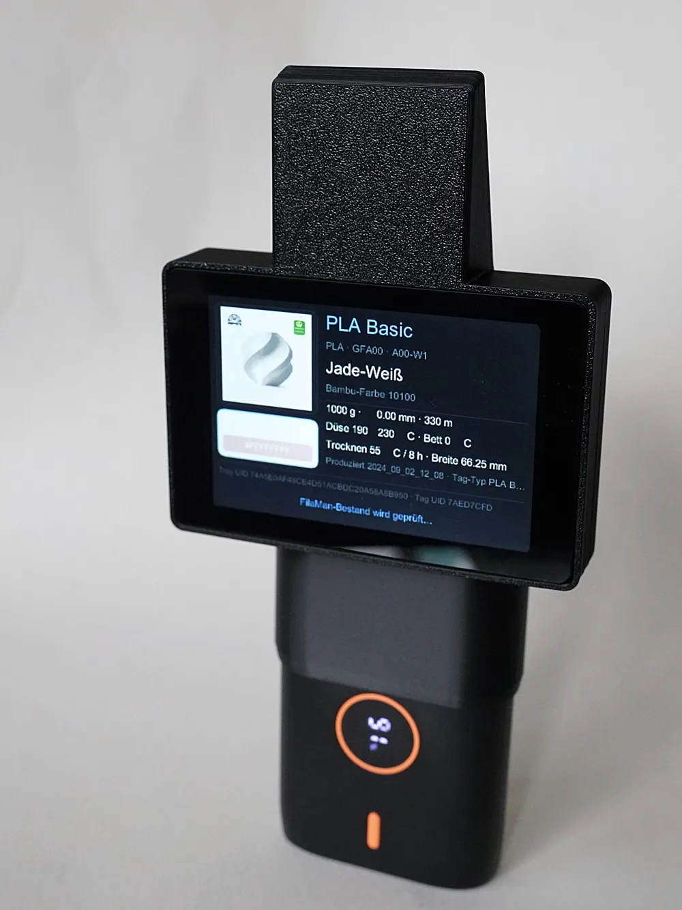

# FilaScan

FilaScan turns a WT32-SC01 Plus with a PN532 or PN5180 into a standalone
filament spool reader. Hold a spool against the reader to see its material,
color, product image and spool parameters, and optionally manage it in FilaMan.

- Read Bambu Lab spool tags and OpenPrintTag tags (OpenPrintTag requires PN5180).
- Display product details, a large color preview and catalog images.
- Import spools into FilaMan, choose or change their location, and archive them.
- Queue location choices offline on SD and synchronize when connected again.
- English and German interfaces, browser configuration and OTA firmware updates.

## Installation

Connect a **WT32-SC01 Plus with 16 MB flash** by USB and open the
[online installer](https://masonvx.github.io/FilaScan/) in Chrome or Edge on a
computer. It guides you through installation, with an option to retain existing
FilaScan settings. No local build tools are required.

For FilaMan integration, install the
[FilaScan Import plugin](https://github.com/MasonVX/filascan-import), then
register and authorize your scanner as described in the plugin README.

## Portable enclosure

The [portable RFID reader project on MakerWorld](https://makerworld.com/en/models/3291128-rdif-reader-portable#profileId-3734282)
provides a printable enclosure for the scanner.



## Project background

FilaScan is a new application built on the code foundation of
[SpoolEase](https://github.com/yanshay/SpoolEase), via the
[mybesttools fork](https://github.com/mybesttools/SpoolEase). Its spool-reader
interface and FilaMan workflows were developed independently. It is a community
project, not affiliated with Bambu Lab or the SpoolEase maintainers.

## Functionality in detail

FilaScan reads Bambu Lab factory MIFARE Classic 1K tags. With a PN5180 it also
reads OpenPrintTag NFC-V tags containing an NDEF record with the
`application/vnd.openprinttag` MIME type. Tags are read-only and are never
modified. The PN532 does not support the ISO/IEC 15693 protocol required by
OpenPrintTag.

OpenPrintTag data is decoded independently from the Bambu format and converted
to the same internal filament model. The display uses the brand, material,
colors, weights, dimensions, temperature ranges and drying parameters that are
present on the tag. A separate NDEF URI or Smart Poster URI is decoded and
reported in the diagnostics when present. Unknown CBOR fields and unsupported
additional NDEF records are skipped without rejecting an otherwise valid tag.
The parser is tested against the official OpenPrintTag sample for specification
revision `7e09cc3` and has also been verified with a physical Prusament tag.

OpenPrintTag defines exact color values but no separate marketing color-name
field. For Prusament tags, FilaScan uses the manufacturer's material-name suffix
when it contains a product variant (for example, `PLA Galaxy Black` becomes
`Galaxy Black`). Other manufacturers use a localized approximate color family
calculated from the RGB value until a manufacturer-specific resolver is added.
The exact hexadecimal RGBA value remains visible in the color preview.
Bambu-specific color codes are shown only for Bambu tags.
Long manufacturer and material names wrap onto two lines on the device display.

For Bambu tags, the device display shows:

- official Bambu material/product name
- filament type, material ID and variant ID
- official Bambu color name and Bambu color code
- raw RGBA color value
- the matching Bambu product image when Wi-Fi or an SD cache is available
- a large color preview, including a second color when present
- nominal filament weight
- filament diameter and length
- spool width
- nozzle and bed temperatures
- drying temperature and duration
- production date
- 16-byte tray UID and RFID tag UID

The display and configuration page support English and German. The selected
language is stored on the SD card. Bambu color names use the corresponding
language field from the downloaded BambuStudio catalog, with English as the
fallback when a translation is missing. Bambu product and material names such
as `PLA Matte` remain unchanged. Technical diagnostic logs remain in English.

Swipe upward from the bottom edge of the device display to open the firmware
page. It shows the installed version and immediately checks the GitHub-hosted
OTA channel for a newer release. The page reports whether the firmware is
current, an update is available or the check failed. Swipe down from the top
edge or press **Back** to return to the spool reader. Firmware installation
requires confirmation and can be started on this page or in the protected web interface.

The web interface includes a live diagnostic log for RFID detection, retries,
read failures and successful spool mappings. Every successful scan prints the
relevant decoded fields. Bambu scans also include a hexadecimal dump of every
payload block read from the tag.
Authentication keys and Wi-Fi credentials are not logged. The in-memory log
retains the most recent 120 lines and is cleared when the device restarts.

The tag stores raw identifiers and values. FilaScan downloads the official
[`filaments_color_codes.json`](https://github.com/bambulab/BambuStudio/blob/master/resources/profiles/BBL/filament/filaments_color_codes.json)
catalog directly from BambuStudio. The catalog is validated before use and
cached as `/filascan/catalog/catalog.jsn` on the SD card. It supplies the official
filament type, color name and five-digit Bambu color code. The lookup primarily
uses the RFID material ID and variant color code, with the RFID color value and
the existing compact legacy mappings as fallbacks. Unknown entries remain
readable through their raw identifiers and hexadecimal color values.

Automatic catalog updates run once every 24 hours while Wi-Fi is available.
The source URL, automatic updates and a manual update action are available on
the protected configuration page. Only direct HTTPS URLs on
`raw.githubusercontent.com` are accepted. A failed download or invalid JSON
does not replace the last valid SD-card cache.

For a recognized five-digit Bambu product code, FilaScan queries Bambu's EU
Store `globalSearchV2` API. It accepts only one exact search result and uses the
highlighted SKU's first `mediaFiles` product image, matching the resolver used
by the FilaMan Bambu Lab plugin. The selected CDN image is requested as a
240-pixel JPEG and shown above the color preview. No product-page scraping or
static product-image mapping is included in the firmware.

Store API and image downloads use HTTPS with certificate validation, restricted
Bambu hosts, response-size limits and image-dimension checks. If Wi-Fi is
unavailable, the product code is unknown or the lookup fails, the spool data
and color preview remain available without an image.

Product images are not stored in device flash. With an SD card installed,
FilaScan checks `/filascan/images/<product-code>.jpg` before contacting the
Bambu Store API. A valid cache hit is displayed without a network request and
survives restarts and firmware updates. Invalid JPEG files are ignored and
downloaded again when Wi-Fi is available. Cached images do not expire or refresh
automatically; delete the corresponding file or the complete
`/filascan/images/` directory to force a new download. Without an SD card, the
downloaded image is kept only for the current display session and the next scan
must fetch it again. Product images remain Bambu Lab content and are retrieved
at runtime; they are not included in the firmware image.

Product enrichment is separate from tag decoding. Bambu product images use the
existing Bambu resolver. For OpenPrintTag, FilaScan derives the database brand
and material slugs from the tag's brand and material names and requests the
fixed public endpoint at `https://database.openprinttag.org`. The returned
material JSON may supply missing colors and temperature parameters, plus tags,
certifications, density, hardness and transmission distance. Values present on
the NFC tag take precedence. A missing or unreachable database entry never
prevents the tag data from being displayed.

OpenPrintTag material metadata is cached under
`/filascan/optag/<material-hash>.jsn`. The first supported photo URL is accepted
only from `files.openprinttag.org`, requested through its 240-pixel JPEG image
endpoint and cached as `/filascan/optag/<material-hash>.jpg`. Both hosts use
validated HTTPS, fixed host allowlists and response-size limits. Cached data is
used without Wi-Fi and survives restarts and firmware updates. Cache files do
not expire automatically. The OpenPrintTag database base URL is intentionally
fixed and is not exposed as a configuration setting.

### FilaMan integration

FilaScan can add a recognized Bambu or OpenPrintTag spool to a separate
[FilaMan](https://github.com/Fire-Devils/filaman-system) instance. Bambu uses
`bambulab:<TRAY_UUID>` as its unique FilaMan identity; OpenPrintTag uses
`openprinttag:<instance-uuid>`. The physical NFC Tag UID is not included in any
FilaMan request.

After a scan, FilaScan first checks whether that source identity is already registered.
For an existing spool, its current location appears as a button in the spool
view. Pressing it opens the location selector; choosing another regular
location moves the existing spool and records the change through the FilaMan
plugin. The same dialog can archive an existing spool after an explicit
confirmation, allowing other integrations to remove it from their active
inventory while preserving its identity and synchronization history. For a new
spool, FilaScan opens the same selector before creating it.
Bambu AMS locations whose identifier starts with `bambulab` are excluded. The
spool is created only after the user chooses a regular storage location; Cancel
leaves FilaMan unchanged.

The confirmed import sends the decoded spool data and selected `location_id` in
one authenticated request to the FilaScan integration plugin at
`POST /api/v1/devices/filascan/import-spool`, using `type=bambu` or
`type=openprinttag`. The plugin owns the
transactional, idempotent creation or resolution of the manufacturer, colors,
filament and spool.

The compatible FilaMan integration plugin must be installed and the registered
FilaScan device must be authorized by that plugin. Create a device in FilaMan,
then enter its six-character one-time registration code on FilaScan's protected
web page. FilaScan exchanges the code through
`POST /api/v1/devices/register`, validates the returned
`dev.<device-id>.<secret>` token and stores it on the SD card. The one-time code
is never stored or written to the diagnostic log. The permanent token is never
returned to the browser after it has been stored. The configuration page shows
only the registration state and non-secret device identity. **Log out** removes
the credential from FilaScan but does not delete or revoke the device in
FilaMan.

After registration, select the now-active device on the FilaScan import
plugin's configuration page in FilaMan. General FilaMan inventory scopes are
not required. FilaScan shows the numeric device ID from the token. It also
accepts an optional `device_name` returned by the plugin status endpoint; older
plugin versions that do not provide it fall back to `Device #<id>`. FilaMan
integration is disabled by default.
The connection test calls `GET /api/v1/devices/filascan/status` and verifies
that the plugin reports `ready` with `location_selection: true` and
`location_management: true` and `spool_archiving: true`.

While a device is registered, FilaScan sends the official FilaMan device
heartbeat every 60 seconds. The heartbeat reports the local IPv4 address and
updates the device's last-seen timestamp, allowing FilaMan to show its current
online state and network address. Heartbeats are skipped while another FilaMan
operation is active. FilaMan marks a device offline after three minutes without
a heartbeat.

FilaScan also maintains an offline inventory from the existing paginated
`GET /api/v1/spools` and `GET /api/v1/locations` routes. The active spool IDs,
locations and canonical external IDs are kept in RAM. A deterministic JSON
snapshot is written to the SD card only when its serialized contents change;
unchanged refreshes cause no SD write. The first refresh runs after FilaMan is
reachable, then at a reduced interval and after queued changes are synchronized.

When Wi-Fi or FilaMan is unavailable, the cached inventory is used to identify
known spools and display their last synchronized location. Choosing a storage
location creates or replaces one pending operation for that spool on the SD
card. The physical NFC Tag UID is excluded from this persisted operation. Once
the heartbeat recovers, pending operations are applied sequentially through the
existing FilaScan plugin import and location endpoints. Successful operations
are removed in one queue update and the inventory snapshot is refreshed. A
power interruption before that update can only repeat an idempotent operation;
it cannot silently lose the requested location.

The configuration page reports whether FilaMan is online, the number of cached
spools and locations, and the number of pending operations. Offline storage
requires an SD card and a previously downloaded location list. RFID decoding
and spool display continue to work without either FilaMan or an SD card.

For HTTPS, FilaScan validates the server certificate against the configured
PEM CA before sending the token or spool data. Direct HTTP URLs are also
supported for trusted local networks and do not require a CA certificate; the
token and spool data are then transmitted without transport encryption.
Settings are stored on the SD card.

Spoolman support may be implemented as a separate integration later.

## Hardware

Supported hardware:

- WT32-SC01 Plus with ESP32-S3 and 16 MB flash
- PN532 or PN5180 RFID reader connected over SPI
- ESP32-S3 USB JTAG/serial interface for flashing
- FAT-formatted microSD card for offline FilaMan operations, registration data,
  catalog metadata and product image caches; RFID scanning itself does not
  require the card

### PN532 wiring

| PN532 signal | ESP32-S3 GPIO |
|---|---:|
| IRQ | 14 |
| SCK | 13 |
| MOSI | 11 |
| MISO | 12 |
| CS | 10 |

The PN532 backend uses SPI mode 0 on the shared 500 kHz reader bus. Display,
touch and board wiring follow the original
[SpoolEase Console hardware documentation](https://docs.spoolease.io/docs/build-setup/console-build).

### PN5180 wiring

FilaScan supports the common `PN5180-NFC R1.1-170710` module. Connect both
power rails shown on that module.

| PN5180 signal | WT32-SC01 Plus |
|---|---:|
| +5V | Extended I/O pin 1 (+5V) |
| +3.3V | Debug header +3.3V |
| RST | GPIO 21 (Extended I/O pin 8) |
| NSS | GPIO 10 |
| MOSI | GPIO 11 |
| MISO | GPIO 12 |
| SCK | GPIO 13 |
| BUSY | GPIO 14 |
| GND | GND |

Leave `GPIO`, `IRQ`, `AUX` and `REQ` disconnected. The PN5180 uses SPI mode 0,
MSB first. The shared bus starts at 500 kHz for reliable detection of either
reader. The PN532 backend reverses its wire bytes in software as required by
the PN532 SPI protocol.

At startup, FilaScan resets GPIO 21 and validates the PN5180 product, firmware
and EEPROM versions. A valid response selects the PN5180 backend. Otherwise it
starts the PN532 backend using GPIO 14 as its IRQ input. Only one reader module
may be connected at a time.

The PN5180 backend retains successfully decoded payload blocks across retries.
It allows up to five payload attempts but stops after two consecutive attempts
without reading another block. A tag is considered removed after 750 ms of
confirmed absence, and persistent transient activation errors trigger an RF
field refresh after two seconds.

Automatic detection is the default. A build can force one backend when needed:

```bash
FILASCAN_RFID_READER=pn532 ./scripts/build-firmware.sh
FILASCAN_RFID_READER=pn5180 ./scripts/build-firmware.sh
```

Any other value, or an unset variable, selects automatic detection. The
explicit PN5180 mode does not fall back to PN532 when detection fails.

## Web interface

The web interface provides language selection, Wi-Fi configuration, Bambu
catalog update settings, FilaMan integration settings, firmware updates and a
read-only live diagnostic log. It contains no local inventory, printer, MQTT,
scale or filament-management settings.

When no Wi-Fi credentials are stored, FilaScan creates an access point named
`FilaScan`. Connect to it and open:

```text
http://192.168.2.1/config
```

The display shows the temporary setup key. Enter that key on the configuration
page, enter the Wi-Fi SSID and password, then select **Save and restart**.

Wi-Fi credentials are stored in device flash. The configuration page remains
available through the device's local network address after provisioning.
When stored credentials are present but no Wi-Fi connection and IPv4 address
can be established within 60 seconds after startup, FilaScan starts its setup
access point at `http://192.168.2.1/config`. The stored credentials are retained.
This fallback is evaluated only during startup. If a connection that was
successfully established during startup is lost later, FilaScan retries that
network without enabling the setup access point; restart the device to open a
new 60-second fallback window.
The selected language, catalog settings, FilaMan settings and the last valid
downloaded catalog are stored on the SD card. Without an SD card, language
changes apply only to the current session, and a catalog can still be
downloaded into memory but cannot be retained across restarts. FilaMan
integration settings cannot be saved without an SD card.

The diagnostic log records the ESP32 reset reason at startup. This provides a
passive indication of power, software and watchdog resets after a restart; it
does not require a persistent USB or browser diagnostic connection.

### Firmware updates

FilaScan supports user-initiated over-the-air updates through the protected web
interface. **Check for updates** reads the release manifest; **Install update**
is enabled only when the published semantic version is newer than the running
firmware. Installation requires confirmation. Progress and failures are shown
on the configuration page and written to the live diagnostic log. The device
restarts after a successful installation.

OTA downloads use validated HTTPS and are written to the inactive application
partition. Wi-Fi is required, but an SD card is not. Settings in flash and files
on the SD card are not replaced. The first OTA-capable firmware must be flashed
over USB. Partition-table or bootloader changes still require the merged USB
image. A newly installed image is confirmed only after the core display, reader,
web and network tasks initialize; the ESP-IDF bootloader can otherwise return to
the previous application partition after a failed first boot.

The update channel is hosted entirely by GitHub at
`https://masonvx.github.io/FilaScan/`. It hosts the USB web installer alongside
`ota.toml` and the matching application image; no separate server is required. The
current updater verifies the image size and CRC32 supplied by the HTTPS
manifest. Keep the merged release image available as a USB recovery path.

### Install from your browser

Open [Install FilaScan](https://masonvx.github.io/FilaScan/) in Chrome or Edge on
a computer and connect a **WT32-SC01 Plus (ESP32-S3, 16 MB flash)** via a USB
data cable. No existing FilaScan installation or local build tools are needed.
The chip family is detected, but the specific display board is not.

Leave **Erase device** unchecked (the default) to preserve Wi-Fi settings on
FilaScan installations using the current partition layout. The installer writes
only the bootloader, partition table, OTA selection data and first application
slot. It resets the boot selection to that slot while leaving the settings
partitions untouched. Preservation is not guaranteed for other firmware or older
partition layouts; use **Erase device** for a fresh installation in that case.

Both modes leave the SD card untouched, including FilaMan device tokens and
queued offline operations. Erasing internal flash does not unregister the device
from FilaMan. After a fresh installation, Wi-Fi setup becomes available after
60 seconds without a connection.

The website workflow reuses the latest stable release assets and verifies their
checksums. Website-only changes do not require a firmware release. Future
firmware releases publish the installer and OTA channel together. Packaging
rejects unexpected partition layouts rather than risking stored settings.

## Building on macOS

Requirements:

- macOS; the current setup was tested on Apple Silicon
- [Homebrew](https://brew.sh/)
- the device connected over USB

Install the build tools and the pinned Espressif Rust toolchain:

```bash
./scripts/bootstrap-macos.sh
```

Build the release firmware:

```bash
./scripts/build-firmware.sh
```

The merged flash image is written to:

```text
build/FilaScan-esp32s3.bin
```

The same build also creates the application-only OTA image, `ota.toml`,
`SHA256SUMS` and `build-info.txt`. Local builds and GitHub Actions use the same
packaging script.

Flash the connected device:

```bash
./scripts/flash-device.sh
```

If no port is provided, the flash script automatically uses the only connected
USB serial device. It stops and lists the choices when multiple devices are
present. Flashing always rebuilds and refuses uncommitted firmware-source or
build-script changes, so every installed binary corresponds to a commit.

Attach the serial monitor without resetting the running device:

```sh
./scripts/monitor-device.sh [/dev/cu.usbmodem...]
```

## Codex development skills

Repository-scoped Codex skills are stored in `.agents/skills`:

- `filascan-device` covers firmware builds, committed-source flashing, safe
  serial monitoring and device diagnosis.
- `filascan-release` covers version metadata, release preflight, tag-triggered
  publication and OTA verification.

The skills provide project-specific decisions and safety rules. Deterministic
operations remain in `scripts/`, so they can be used directly and by CI without
Codex. Before a release, run:

```sh
./scripts/release-preflight.sh <version>
```

## Continuous integration

The workflow in
[`firmware.yml`](.github/workflows/firmware.yml) builds the ESP32-S3 release
firmware on pushes to `main`, pull requests and manual runs. It uploads the
merged USB binary, an OTA application image, SHA-256 checksums, the OTA manifest
and build metadata as a GitHub Actions artifact. The build job has read-only
repository permissions and does not use repository secrets.

Tags matching `filascan-v*` run the same reproducible build and create a GitHub
release containing both firmware images, checksums, the OTA manifest and build
metadata. The same tag deploys the web installer, OTA image and manifest to GitHub Pages. Only
the release job receives permission to create releases; the Pages job receives
only `pages: write` and OIDC token permissions. The FilaScan version in
`core/Cargo.toml` must match the numeric part of the tag. GitHub Pages must use
**GitHub Actions** as its source in the repository settings before the first OTA
publication.

[`website.yml`](.github/workflows/website.yml) publishes website-only changes
using the latest stable release's verified binaries, without rebuilding firmware.
Both publication workflows share a Pages concurrency group.

## Repository structure

| Path | Purpose |
|---|---|
| `core/src/bambu_spool.rs` | Bambu tag parsing and local product mapping |
| `core/src/spool.rs` | Manufacturer-neutral filament model and product enrichment identity |
| `core/src/catalog.rs` | BambuStudio catalog download, validation and SD cache |
| `core/src/openprinttag_catalog.rs` | Fixed OpenPrintTag database lookup, tag-first enrichment and SD metadata cache |
| `core/src/filaman.rs` | FilaMan plugin HTTP(S) client and Bambu import payload |
| `core/src/image_loader.rs` | Restricted Bambu/OpenPrintTag image downloads, SD cache and JPEG decoding |
| `core/src/localization.rs` | Display and web language selection with SD persistence |
| `core/src/diagnostics.rs` | Bounded in-memory diagnostic log |
| `core/ui/` | Slint display UI |
| `core/static/` | Protected Wi-Fi, catalog, FilaMan and OTA configuration |
| `shared/src/reader.rs` | Reader selection and hardware-neutral event interface |
| `shared/src/pn532_reader.rs` | PN532 detection, ISO-A selection and read recovery |
| `shared/src/pn5180.rs` | PN5180 SPI, BUSY, ISO-A/MIFARE Classic and NFC-V driver |
| `shared/src/pn5180_reader.rs` | PN5180 protocol scan loop and payload reads |
| `shared/src/nfc.rs` | Shared Bambu key derivation and payload block definition |
| `formats/` | Hardware-independent, no-std OpenPrintTag NDEF/CBOR decoder and tests |
| `scripts/` | macOS bootstrap, firmware build and flashing |

## AI-assisted development

OpenAI Codex was used to assist with source analysis, implementation, build
configuration and documentation. Changes are reviewed through the same build
and hardware testing process as other contributions.

## References

- [yanshay/SpoolEase](https://github.com/yanshay/SpoolEase)
- [mybesttools/SpoolEase](https://github.com/mybesttools/SpoolEase)
- [BambuStudio filament color catalog](https://github.com/bambulab/BambuStudio/blob/master/resources/profiles/BBL/filament/filaments_color_codes.json)
- [Bambu Research Group RFID Tag Guide](https://github.com/Bambu-Research-Group/RFID-Tag-Guide)
- [FilamentDB](https://db.filaman.app/)
- [FilaMan](https://github.com/Fire-Devils/filaman-system)
- [Amazon Trust Services certificate repository](https://www.amazontrust.com/repository/)
- [DigiCert trusted root certificates](https://www.digicert.com/kb/digicert-root-certificates.htm)
- [Let's Encrypt certificates](https://letsencrypt.org/certificates/)
- [NXP PN532](https://www.nxp.com/products/rfid-nfc/nfc-hf/nfc-readers/standard-performance-mifare-and-ntag-frontend:PN5321A3HN)
- [NXP PN5180](https://www.nxp.com/products/PN5180)
- [NXP AN12650: Using the PN5180 without library](https://www.nxp.com/docs/en/application-note/AN12650.pdf)
- [OpenPrintTag specification](https://github.com/OpenPrintTag/openprinttag-specification)
- [Spoolman](https://github.com/Donkie/Spoolman)

## License

FilaScan retains the inherited Apache License 2.0 with Commons Clause terms.
See [`LICENSE.md`](LICENSE.md).
